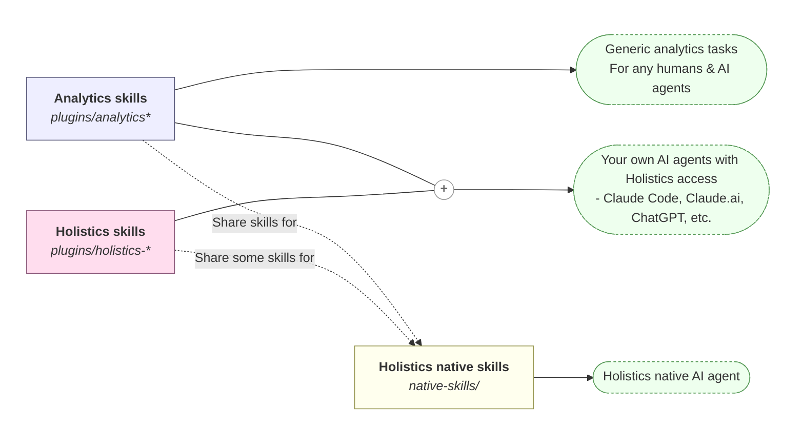

# Holistics
[Holistics](https://holistics.io) is a modern BI platform that aims to enable self-service data access for entire organization by leveraging analytics-as-code and AI.

# Vision
This is a shared, open repository for analytics skills — both generic and Holistics-specific — designed to grow with the community:

* **A commons for analytics skills.** Data analysts and engineers can contribute and reuse common analytics skills. We expect these to evolve over time into rich, business-domain-specific analytics knowledge and skills that any team can build on.
* **A space for Holistics users to share with each other.** Skills, references, and workflows that work well for one Holistics team can be packaged and shared with the rest of the community.
* **A window to optimize Holistics' native AI agent.** Holistics users can read and import skills for their Holistics native AI agent.



Contributions are welcome — see [Contributions are welcomed](#contributions-are-welcomed) below.

# How to install

## For your own AI agent
Skills under `plugins/` (Holistics-specific skills and generic analytics skills) can be used by any AI coding or chat agent — Claude Code, Claude.ai, ChatGPT, Codex, and others.

The easiest install path is the Claude Code plugin marketplace (shown below). For other agents, you can import or copy the skill files directly from this repo.

### Claude Code
Within Claude Code, run this command to add the Holistics skills marketplace:
```bash
/plugin marketplace add holistics/skills
```

Then browse and install the relevant plugins via `/plugin` > `Marketplaces` > `holistics-skills` > `Browse plugins` > Install.

(Optional) enable auto-update via `/plugin` > `Marketplaces` > `holistics-skills` > `Enable auto-update`.

### Picking a plugin
Browse the linked `skills/` folders to see the actual skill files for each plugin.

* [`analytics`](./plugins/analytics/skills/): Generic analytics workflows (data exploration, analysis, reporting) that aren't tied to Holistics. Use it on its own, or alongside the plugins below.
* [`analytics-finance`](./plugins/analytics-finance/skills/): Finance and SaaS metrics — lifetime value, unit economics, and similar workflows.
* [`holistics-development`](./plugins/holistics-development/skills/): When you are developing your AMQL project with coding agents such as Claude Code, Codex, etc.
* [`holistics-reporting`](./plugins/holistics-reporting/skills/): When you want to ask data questions on published AMQL objects (datasets, dashboards, etc.) with general agents such as Claude.ai, ChatGPT, etc.

## For Holistics native agent
Skills under [`native-skills/`](./native-skills/) can be used by Holistics App to extend **Holistics native AI agent**. They run inside Holistics and have access to native web UI and backend features. Browse the folder to see what's available.

* [`optional`](./native-skills/optional/): Optional skills that **can be imported** based on your Holistics organisation's needs.
* [`built-in`](./native-skills/built-in/): Built-in skills that are **already included** in the base skillset of Holistics native AI agent.

To import or override: in the Skill creation UI inside Holistics, select skills on the **From library** tab.

# Contributions are welcomed
We welcome contributions of new skills, improvements to existing ones, and bug fixes — for the generic Analytics plugins, the Holistics-specific plugins, and the native skills used by Holistics' built-in AI agent.

To get started, see [DEVELOPMENT.md](./DEVELOPMENT.md) for the repository structure and tooling. Then open a pull request against `main` with your changes; for new skills, drop them under the appropriate `plugins/<plugin-name>/skills/` directory (or `native-skills/` for the Holistics native AI agent).

For bug reports or ideas, please [open an issue](https://github.com/holistics/skills/issues).

# License
This repository is licensed under the [Apache License 2.0](./LICENSE). By contributing, you agree that your contributions will be licensed under the same terms.